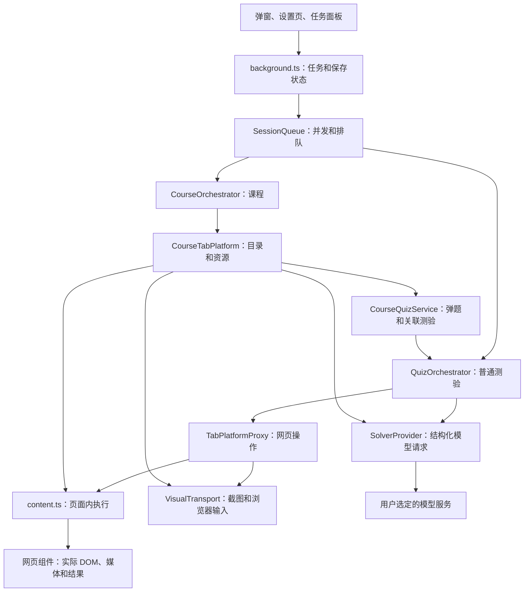

# 系统结构

## 模块关系

## 源码职责

| 目录或入口 | 当前职责 |
| --- | --- |
| `src/core/schema.ts`、`platform.ts` | 题目、答案、动作、观察和平台协议 |
| `src/core/orchestrator.ts` | 普通测验观察、求解、填写、提交、核验和重试 |
| `src/core/course.ts` | 课程范围、资源依赖、视频与测验协调、局部失败和恢复 |
| `src/core/knowledge-practice.ts` | 知到独立知识点练习 |
| `src/core/call-budget.ts`、`session-queue.ts` | 独立预算、请求预留、并发与排队 |
| `src/web` | 实际 DOM、网页识别、站点组件、媒体和框架几何 |
| `src/provider` | Provider 配置、模型目录、能力、请求和费用规则 |
| `src/extension/background.ts` | 会话管理、准备会话、保存、恢复、权限和消息分发 |
| `src/extension/content.ts` | 在实际页面中校验与执行操作 |
| `src/extension/visual-transport.ts` | 授权标签页的截图、坐标输入和正常悬停 |
| `src/extension/popup.ts`、`options.ts`、`tasks.ts` | 三个用户界面的行为 |
| `static` | Manifest、界面 HTML、样式、图标及扩展名称翻译 |

## 普通测验

网页适配器产生 `PlatformObservation`，包含当前测验、题目和本地定位映射。核心检查结构和能力，按 Provider 限制生成批次。模型返回结构化答案，经答案校验后建立受限动作计划。网页组件执行动作，`WebVerifier` 比较操作前后的实际状态，决定提交、重答、翻页或结束。

页面模型识别与答案求解使用同一场预算。定位映射只留在本地。快照模式中的结构识别和截图模式中的视觉识别都要先通过本地检查。

## 课程

加载课程创建准备会话，并保存所选模型和预算。`CourseTabPlatform` 从实际页面取得完整目录，`CourseOrchestrator` 按选择范围和前置条件推进课时。子测验使用 `CourseQuizService`，共享本门课程的预算。

同一课时先发现资源，已有结果经实际记录核验后采用。运行中的视频、弹题和测验交接输入控制；局部失败保留待处理任务，独立资源继续执行。媒体结束、平台任务记录和测验及格结果分别确认。

## 保存、隔离和取消

后台使用 `chrome.storage.session` 保存当前浏览器会话快照，使用 `chrome.storage.local` 保存 Provider、偏好及课程恢复记录。准备会话预算和课程操作状态在请求或提交前保存。

每个任务有独立会话 ID、操作版本、取消信号、预算及页面目标。运行队列在请求真正结束后释放名额。暂停和停止撤销操作授权并取消请求；旧回复通过取消与版本检查被阻止。浏览器重启后的课程恢复先核验实际身份和结果。
